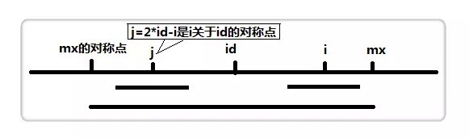

# Manacher

## 算法背景

查找字符串中的最长回文子串

## 算法思路

1. 在每个字符间插入一个标记字符以简化奇偶回文的区分。举个例子：`s="abbahopxpo"`，转换为`s_new="$#a#b#b#a#h#o#p#x#p#o#"`（这里的字符 $ 只是为了防止越界。
2. 定义一个辅助数组`p[]`，其中p[i]表示以i为中心的最长回文的半径。可以看出，`p[i] - 1`正好是原字符串中最长回文串的长度。

| i        | 0    | 1    | 2    | 3    | 4    | 5    | 6    | 7    | 8    | 9    | 10   | 11   | 12   | 13   | 14   | 15   | 16   | 17   | 18   | 19   |
| :------- | :--- | :--- | :--- | :--- | :--- | :--- | :--- | :--- | :--- | :--- | :--- | :--- | :--- | :--- | :--- | :--- | :--- | :--- | :--- | :--- |
| s_new[i] | $    | #    | a    | #    | b    | #    | b    | #    | a    | #    | h    | #    | o    | #    | p    | #    | x    | #    | p    | #    |
| p[i]     |      | 1    | 2    | 1    | 2    | 5    | 2    | 1    | 2    | 1    | 2    | 1    | 2    | 1    | 2    | 1    | 4    | 1    | 2    | 1    |



3. 设置两个变量，mx 和 id 。mx 代表以 id 为中心的最长回文的右边界，也就是`mx = id + p[id]`。假设我们现在求`p[i]`，也就是以 i 为中心的最长回文半径，如果`i < mx`，如上图，那么：

```
if (i < mx)  
    p[i] = min(p[2 * id - i], mx - i);
```

`2 * id - i`为 i 关于 id 的对称点，即上图的 j 点，而**p[j]表示以 j 为中心的最长回文半径**，因此我们可以利用`p[j]`来加快查找。

